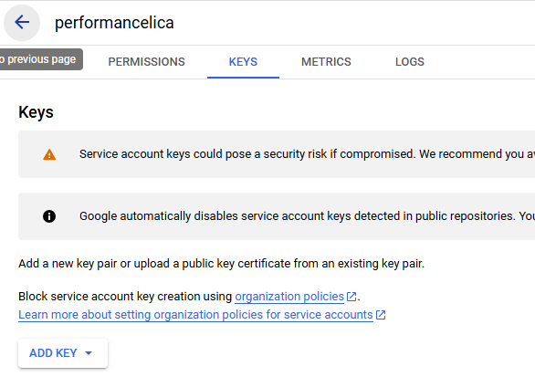

# Ecount Automation
Automated solution to extract data from Ecount.

## Prerequisites
1. Python version 3 installed on your system.

    1.1 Verify Python is installed by entering `python --version` on your terminal.
 
2. Git (optional)
3. Ecount account
4. Google Account to enable Google API services

### How to clone
1. Open your terminal. Make sure git is installed on your system.
2. Navigate to a directory where you want to store the repository (ex: `"Documents"` or `"Desktop"`)
3. Enter the following command:
    ```
    git clone git@github.com:LednirNaabus/ecount-automation.git
    ```

## Setting it all up
- Before running anything, ensure you have an API key from Ecount. For more information, read [here](https://sboapi.ecount.com/ECERP/OAPI/OAPIView?lan_type=en-PH#).

- Then, create a new `.env` file in the root directory. Copy and paste your API key and/or variable secrets in this file. Refer to the example `.env` file below.

### Example `.env` file

```
API_CERT_KEY = "YOUR API KEY HERE"
OTHER_STUFF = "..."
```

### Setting up Google API and Add Key
- In order for the script to work and import the data to Google Sheets, you will have to create a Google [Service Account](https://cloud.google.com/iam/docs/service-accounts).

1. Go to [Google Cloud Console](https://console.developers.google.com/) and create a new project.

    

2. Enable the APIs required. Click on **Enable APIs and Services**.

    

3. Then search for **Google Sheets API** and **Google Drive API**.

4. Create the credentials for your service account.

    

5. Go to the Navigation menu located on the left and then go to **APIs & Services** > **Credentials** > *__your service account__* > **Keys** > **Add Key**.

    

    This will generate a key for you stored in a `.json` file.

**Note:** Place a copy of the generated key `.json` file under `C:\ecount-automation\config\` in this repository.

## Configuration
Edit the `config.json` file to adjust parameters such as `COMPANY_CODE`, `USER_ID`, etc. You can also add warehouses in the `config.json` file by appending. Adjusting the `json` file will sync with `config.py`.

```json
{
    ...,
    "Warehouses" : {
        "ID1" : "Warehouse1",
        "ID2" : "Warehouse2",
        # add here
    }
}
```

## Initialization (IMPORTANT)
- Before actually running the script, install the required dependencies first.
- Enter `pip install -r requirements.txt` to install the dependecies.

## Run the script
Open your terminal, navigate to the directory where you cloned this project (i.e., `"Documents/ecount-automation/"`).

Enter `python main.py` in your terminal to run the script.
